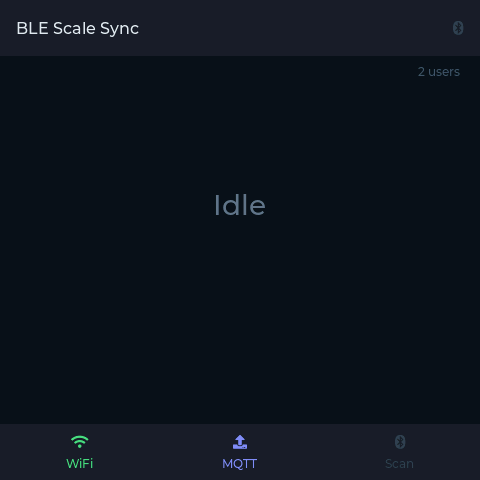

# BLE Scale Sync


A cross-platform CLI tool that reads body composition data from **23 BLE smart scales** and exports to **Garmin Connect**, **Strava**, **MQTT** (Home Assistant), **InfluxDB**, **Webhooks**, **Ntfy**, and **local files** (CSV/JSONL). No phone app needed. Your data stays on your device.

**[Documentation](https://blescalesync.dev)** · **[Getting Started](https://blescalesync.dev/guide/getting-started)** · **[Supported Scales](https://blescalesync.dev/guide/supported-scales)** · **[Exporters](https://blescalesync.dev/exporters)**

## Why This Exists

Most BLE smart scales measure weight and body impedance over Bluetooth, but their companion apps have no way to sync data to **Garmin Connect**. The only workflow was: open the phone app, wait for it to sync, then manually type the numbers into Garmin. Every single time.

I didn't want to depend on a phone app. So I built this tool. A **Raspberry Pi Zero 2W** sits next to the scale, always on, always listening. Step on the scale, wait a few seconds, and the reading appears in Garmin Connect - **no phone needed, no app, no manual entry**. It just works.

If you can't have a Pi next to your scale, a cheap **ESP32 proxy** can sit nearby and relay BLE data over WiFi to a Docker server anywhere on your network. See the [ESP32 BLE proxy guide](docs/guide/esp32-proxy.md).

## Quick Start

### Docker (Linux)

```bash
# Configure
docker run --rm -it --network host --cap-add NET_ADMIN --cap-add NET_RAW \
  --group-add 112 -v /var/run/dbus:/var/run/dbus:ro \
  -v ./config.yaml:/app/config.yaml \
  -v ./garmin-tokens:/app/garmin-tokens \
  ghcr.io/kristianp26/ble-scale-sync:latest setup

# Run (continuous mode, auto-restart)
docker run -d --restart unless-stopped --network host \
  --cap-add NET_ADMIN --cap-add NET_RAW \
  --group-add 112 -v /var/run/dbus:/var/run/dbus:ro \
  -v ./config.yaml:/app/config.yaml:ro \
  -v ./garmin-tokens:/app/garmin-tokens:ro \
  -e CONTINUOUS_MODE=true \
  ghcr.io/kristianp26/ble-scale-sync:latest
```

### Native (Linux, macOS, Windows)

```bash
git clone https://github.com/KristianP26/ble-scale-sync.git
cd ble-scale-sync && npm install
npm run setup                       # interactive wizard
CONTINUOUS_MODE=true npm start      # always-on
```

Requires Node.js v20+ and a BLE adapter. See the **[full install guide](https://blescalesync.dev/guide/getting-started)** for prerequisites and systemd service setup.

## Features

- **[23 scale brands](https://blescalesync.dev/guide/supported-scales)** — Xiaomi, Renpho, Eufy, Yunmai, Beurer, Sanitas, Medisana, and more
- **[7 export targets](https://blescalesync.dev/exporters)** — Garmin Connect, Strava, MQTT (Home Assistant), InfluxDB, Webhook, Ntfy, File (CSV/JSONL)
- **[10 body metrics](https://blescalesync.dev/body-composition)** — BIA-based body composition from weight + impedance
- **[Multi-user](https://blescalesync.dev/multi-user)** — automatic weight-based identification with per-user exporters
- **[Interactive setup wizard](https://blescalesync.dev/guide/configuration)** — scale discovery, exporter config, connectivity tests
- **[BLE diagnostic tool](https://blescalesync.dev/troubleshooting)** — `npm run diagnose` for detailed BLE troubleshooting
- **[ESP32 BLE proxy](docs/guide/esp32-proxy.md)** — use a remote ESP32 as a BLE radio over MQTT, with optional display for status feedback
- **Broadcast mode** — supports non-connectable scales that only advertise weight via BLE advertisements
- **Cross-platform** — Linux (Docker + native), macOS, Windows
- **Private** — your data stays on your device, no vendor cloud

<p align="center">
  
  <br>
  <em>Optional ESP32-S3-4848 display board showing scan status and connection indicators</em>
</p>

## Credits

- **Scale protocols** - ported from [openScale](https://github.com/oliexdev/openScale) by oliexdev and contributors
- **Garmin upload** - powered by [garminconnect](https://github.com/cyberjunky/python-garminconnect) by cyberjunky
- **BLE** - [node-ble](https://github.com/chrvadala/node-ble) (Linux), [@abandonware/noble](https://github.com/abandonware/noble) (Windows), [@stoprocent/noble](https://github.com/stoprocent/noble) (macOS)
- **ESP32 proxy** - [mqtt_as](https://github.com/peterhinch/micropython-mqtt) by peterhinch, [aioble](https://github.com/micropython/micropython-lib/tree/master/micropython/bluetooth/aioble)

## Contributing

See **[CONTRIBUTING.md](CONTRIBUTING.md)** for development setup, project structure, and how to add new scale adapters or exporters.

## License

GPL-3.0 — see [LICENSE](LICENSE) for details.
